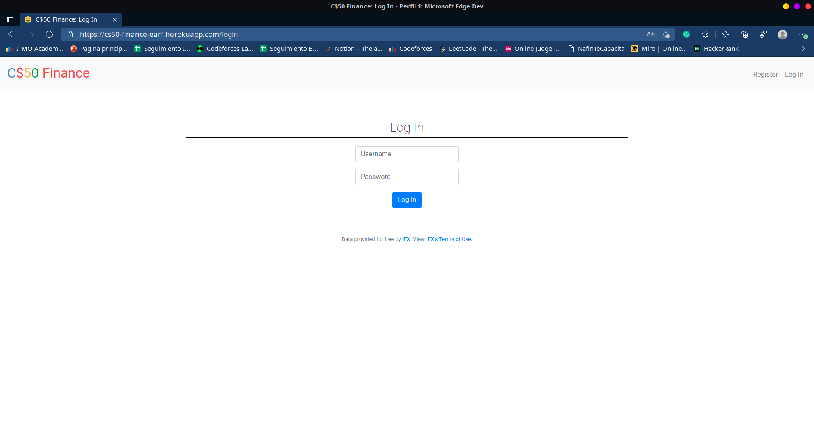
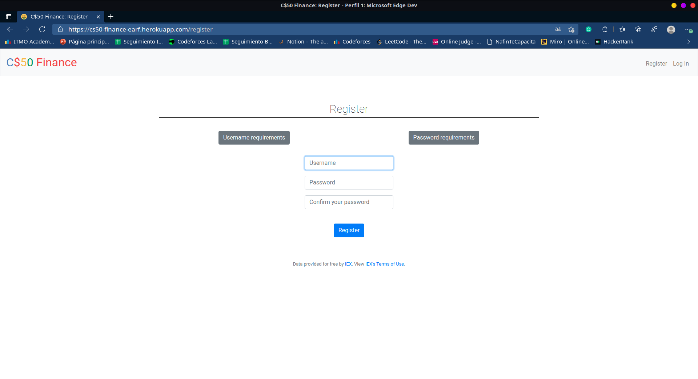
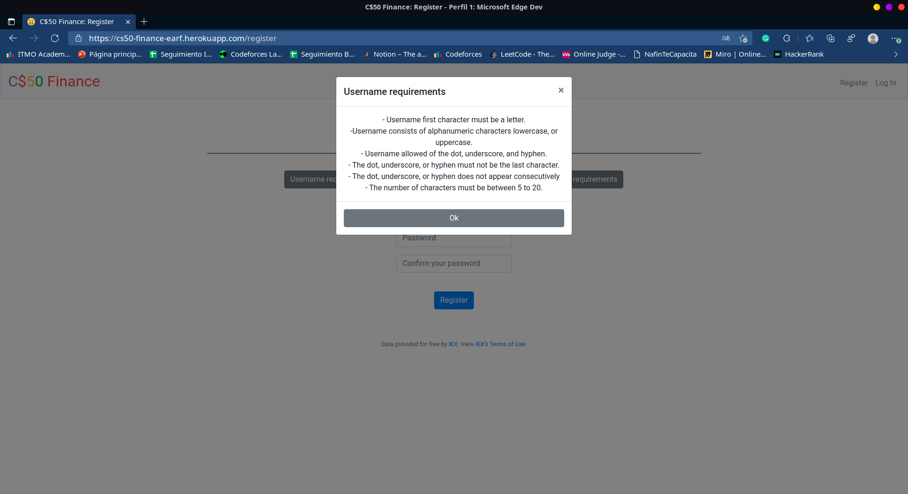
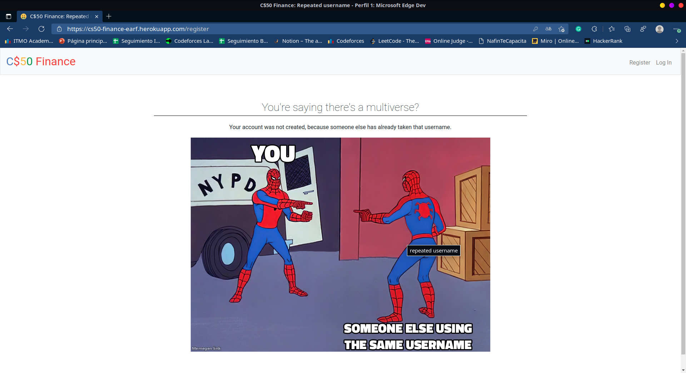
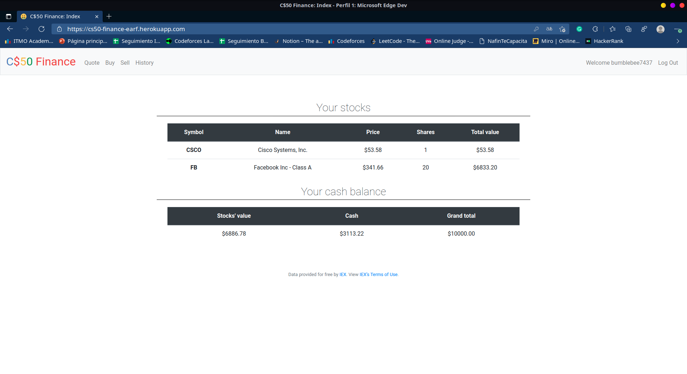
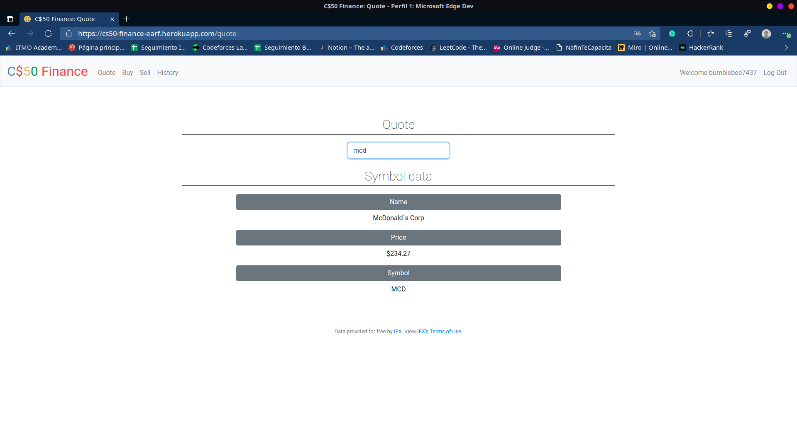
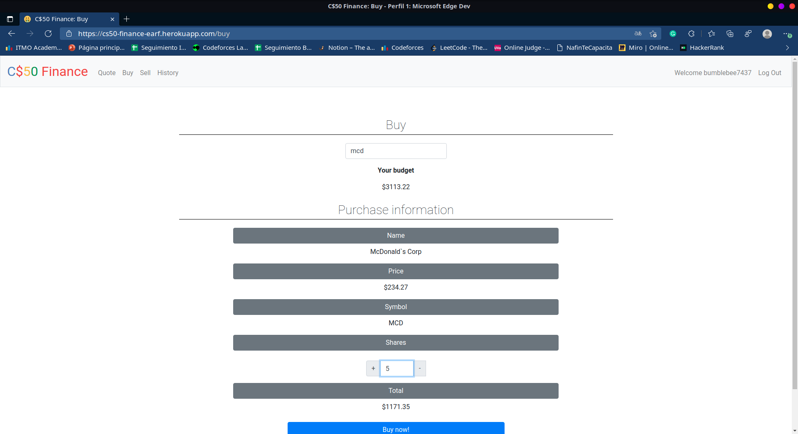
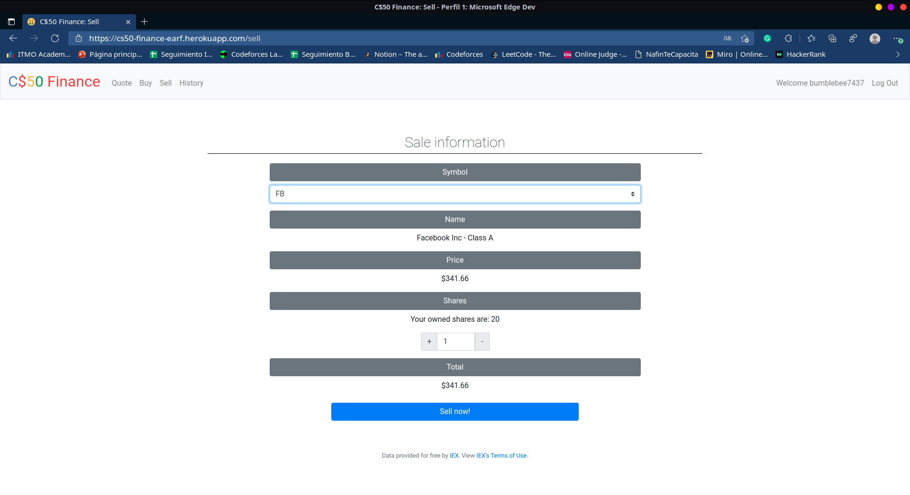
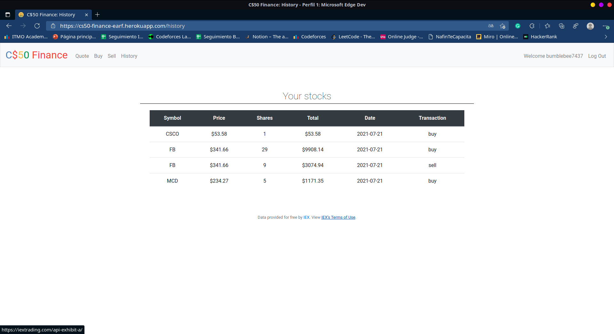

# Project Title

## Table of Contents

- [About](#about)
- [Getting Started](#getting_started)
- [Usage](#usage)
- [Try C$50 Finance](https://cs50-finance-earf.herokuapp.com/)

## About <a name = "about"></a>

Write about 1-2 paragraphs describing the purpose of your project.

## Getting Started <a name = "getting_started"></a>

These instructions will get you a copy of the project up and running on your local machine for development and testing purposes. See [deployment](#deployment) for notes on how to deploy the project on a live system.

### Prerequisites

What things you need to install the software and how to install them.

```
Python3
pip3
sqlite3
cs50
Flask-Session
requests
git
```

### Installing

NOTE: Make sure Python, Git, and SQLite are installed in your machine  

First clone this repo using the following command (using your terminal) in the directory of your choice.
```
git clone https://github.com/EdgarRamirezFuentes/CS50Finance.git
```

Go to the project directory
```
cd CS50Finance/
```

Install the depencencies using the following command (using your terminal)
```
pip install -r requirements.txt
```

Register for an API key in order to be able to query IEX’s data. To do so, follow these steps:

- Visit iexcloud.io/cloud-login#/register/.
- Select the “Individual” account type, then enter your email address and a password, and click “Create account”.
- Once registered, scroll down to “Get started for free” and click “Select Start” to choose the free plan.
- Once you’ve confirmed your account via a confirmation email, visit https://iexcloud.io/console/tokens.
- Copy the key that appears under the Token column (it should begin with pk_).

In a terminal window within CS50 IDE, execute:
```
$ export API_KEY=value
$ export SECRET_KEY=value (this could take any value of your preference)
```

The last step is execute the following command in the same location of the app.py file

```
flask run
```

#### Log in interface


#### Register interface



#### User registered previously interface


#### Index interface


#### Quote interface


#### Buy interface


#### Shares bought successfully interface


#### Sell interface


#### History interface


